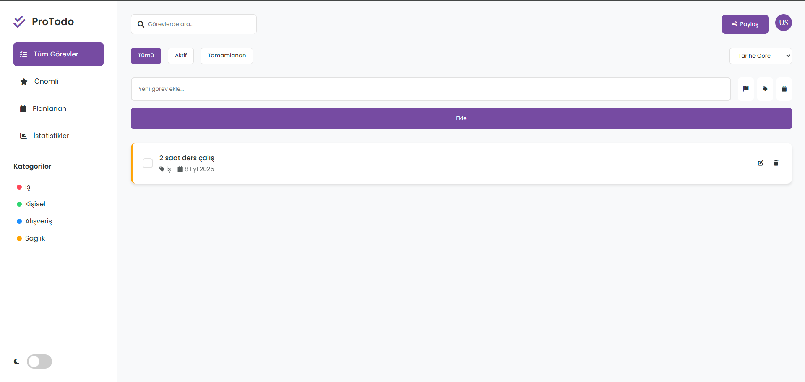
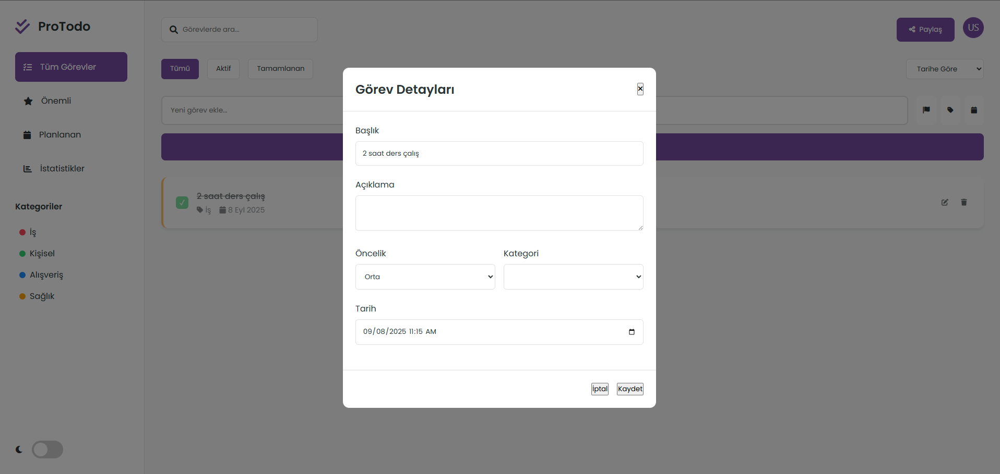

# 📝 ProTodo – Akıllı Görev Yönetim Uygulaması  

Bu proje, modern ve kullanıcı dostu bir **görev yönetim uygulaması**dır. Kullanıcıların görevlerini kolayca ekleyip düzenlemesine, kategorilere ayırmasına, önceliklendirmesine ve tamamlananları takip etmesine olanak tanır.  

  

---

## 🚀 Özellikler  

- ✨ **Görev Ekleme & Düzenleme**: Başlık, açıklama, kategori, tarih ve öncelik bilgisi ile detaylı görev oluşturma.  
- ✅ **Tamamlandı / Aktif Görevler**: Görevleri tek tıkla tamamlanmış olarak işaretleyebilirsin.  
- 📊 **Filtreleme & Sıralama**:  
  - Aktif, tamamlanmış ya da tüm görevleri filtreleyebilirsin.  
  - Görevleri **tarih**, **öncelik** veya **alfabetik** sıraya göre listeleyebilirsin.  
- 🏷️ **Kategori Sistemi**: İş, Kişisel, Eğitim gibi kategoriler oluşturabilirsin.  
- 🔄 **Sürükle & Bırak Sıralama**: Görevler listede kolayca yeniden sıralanabilir.  
- 🌙 **Karanlık / Aydınlık Tema**: Kullanıcı tercihlerine göre değişen modern tema desteği.  
- 🔔 **Paylaşma Özelliği**: Web Share API ile görev listeni hızlıca paylaşabilirsin.  
- 💾 **LocalStorage Desteği**: Tüm görevler tarayıcıda saklanır, sayfa yenilense bile kaybolmaz.  

---

## 🖼️ Ekran Görüntüleri  

### Görev Detay Modalı  
Görevler tek tek düzenlenebilir, açıklama ve tarih eklenebilir.  

  

---

## ⚙️ Kullanılan Teknolojiler  

- **HTML5** – yapısal iskelet  
- **CSS3** – modern responsive tasarım, karanlık & aydınlık tema  
- **JavaScript (ES6)** – görev ekleme, filtreleme, sıralama ve localStorage yönetimi  
- **Sortable.js** – görevleri sürükle-bırak yöntemiyle yeniden sıralama  

---

## 📂 Proje Yapısı  

```
├── index.html      # Uygulama arayüzü
├── style.css       # Tasarım ve tema dosyası
├── script.js       # Uygulama mantığı (JS)
├── 41da2f3a-7326...png   # Ana ekran görseli
├── 7bd96c22-fe5a...png   # Görev modal görseli
```

---

## 🚀 Kurulum & Çalıştırma  

1. Projeyi indir veya klonla:  
   ```bash
   git clone <repo-link>
   cd proje-klasörü
   ```
2. `index.html` dosyasını bir tarayıcıda aç.  
3. Görevlerini eklemeye başla ✅  

---

## 🎓 Not  

Bu proje, kullanıcı deneyimini ön planda tutan modern bir **görev yönetim uygulaması** örneğidir.  
Kendi ihtiyaçlarına göre kategoriler ekleyebilir, önceliklendirme mantığını geliştirebilir veya farklı tema seçenekleri uygulayabilirsin.  
